# HSV Debug Widget

> # **[ 中文 ](#介绍)**

> # **[ English ](#标签)**
 

# 介绍

>

> ## **"加入一个编辑器面板 实时预览选定相机的HSV画面**

## 安装方法：
 
1. > # [点此下载](https://github.com/PMZeroSkyline/HSVDebugWidget/archive/refs/heads/main.zip)

2. 解压下载好的文件，解压好的文件放在引擎的Plugin文件夹中 

    引擎的默认Plugin文件夹为：
    >  **C:\Program Files\Epic Games\UE_4.26\Engine\Plugins**

3. 确保打开了HSVDebug插件

    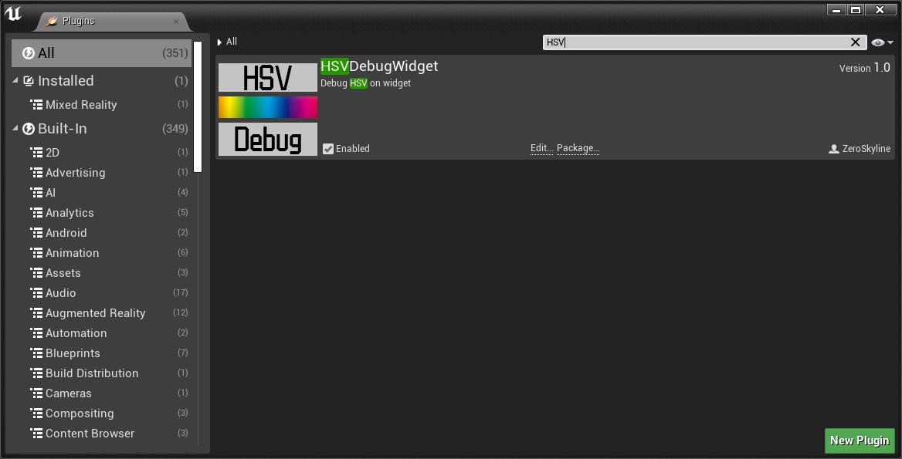  

## 使用方法：

1. 在Content面板的右下角勾选ShowPluginContent

    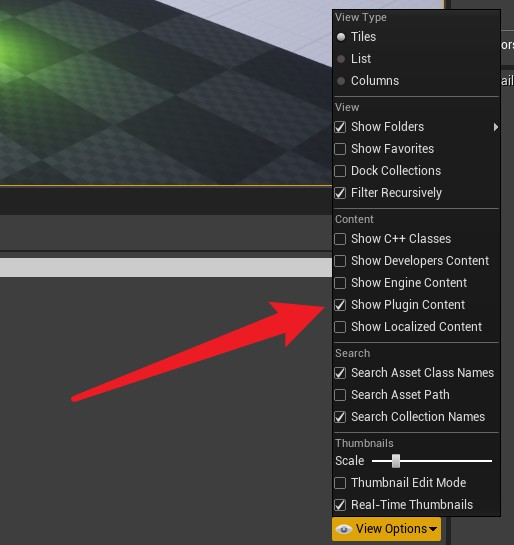  

2. 在Conent面板左上角点击图标展开

    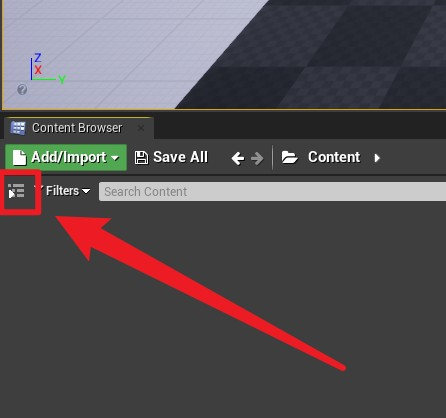  

3. 找到HSVDebugWidget文件夹

    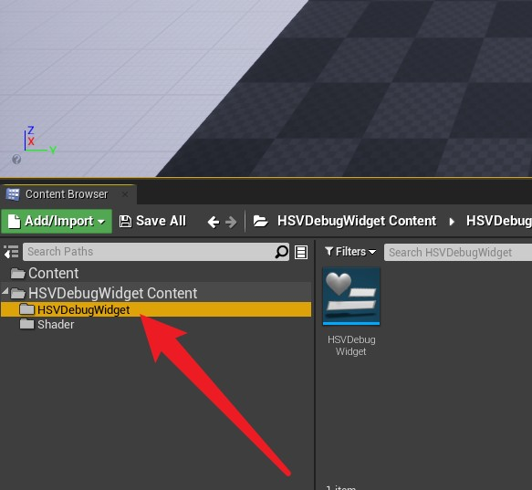  

4. 右键HSVDebugWidget选择RunEditorUtilityWidget

    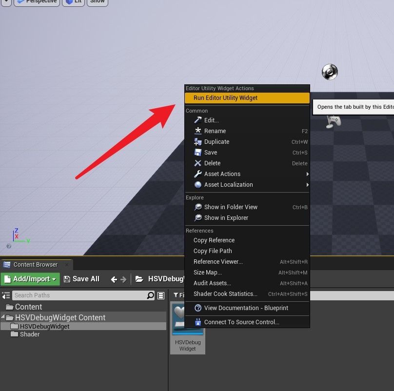  

5. 选择要使用的摄像机

    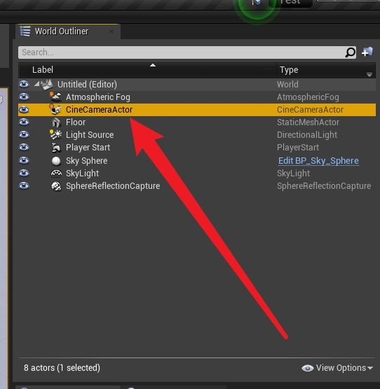  

6. 点击AddComponent

    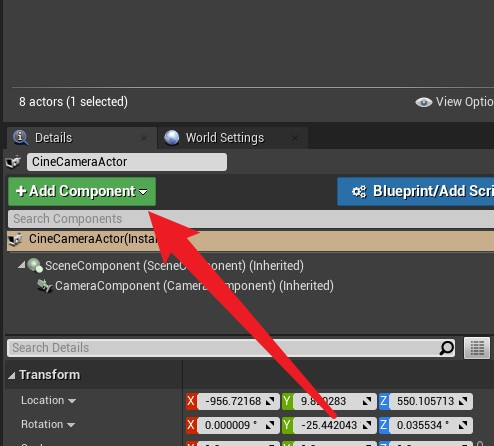  

7. 加入 Scene Capture Component 2D

    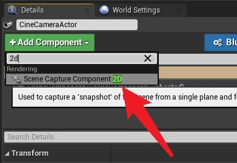  

8. 选中 Scene Capture Component 2D

    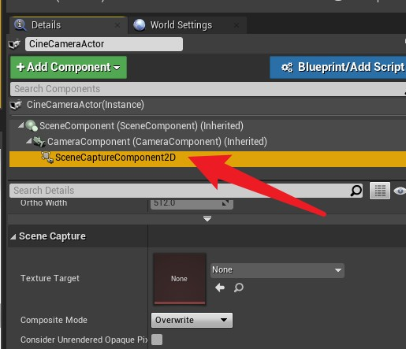  

9. 设置Texture Target 为 HSVDebugTexture

    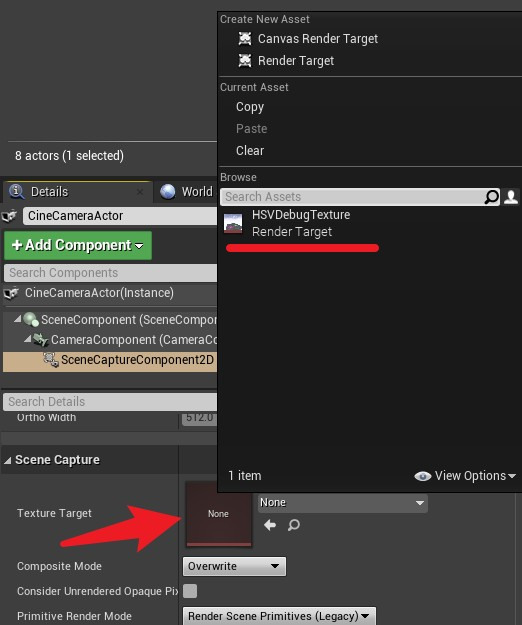  

10. 完成!

    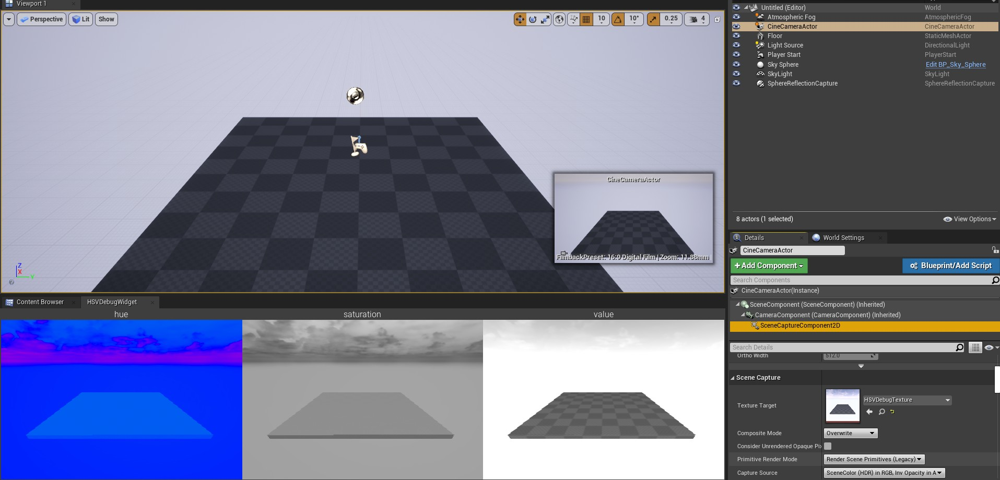  

### *本软件为一人开发 任何人都可以免费使用 没有广告 以开源 [点我下载我的其它免费应用](https://pmzeroskyline.github.io/FreeApps/)*

由 [guzhang0@gamil.com](https://github.com/PMZeroSkyline) 提供支持 欢迎错误反馈

# 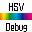  请我喝杯咖啡 ♥：

# 标签

>

> ## **Add an editor panel to preview the HSV screen of a selected camera in real time**

## Installation:

1. > # [Click here to download](https://github.com/PMZeroSkyline/HSVDebugWidget/archive/refs/heads/main.zip)

2. Unzip the downloaded file and place the unzipped file in the engine's Plugin folder 

    The default Plugin folder for the engine is：
    >  **C:\Program Files\Epic Games\UE_4.26\Engine\Plugins**

3. Make sure the HSVDebug plugin is turned on

      

## How to use:

1. Check ShowPluginContent in the bottom right corner of the Content panel

      

2. Click the icon in the top left corner of the Conent panel to expand

      

3. Find the HSVDebugWidget folder

      

4. Find HSVDebugWidget folder right click HSVDebugWidget and select RunEditorUtilityWidget

      

5. Select the camera to be used

      

6. Click AddComponent

      

7. Add Scene Capture Component 2D

      

8. Check the Scene Capture Component 2D

      

9. Set Texture Target to HSVDebugTexture

      

10. Done!

      

### *This software is developed by one person and is free for anyone to use without ads and is open source [click me to download my other free apps](https://pmzeroskyline.github.io/FreeApps/)*

Powered by [guzhang0@gamil.com](https://github.com/PMZeroSkyline) Welcome error feedback

#   Buy me a cup of coffee ♥：

