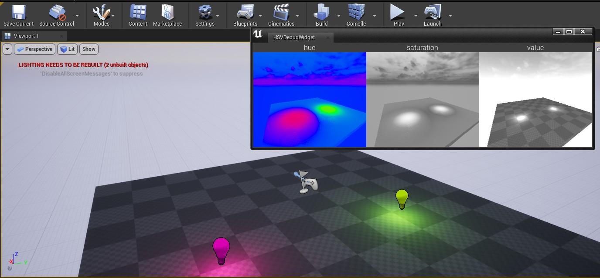

# HSV Debug Widget

> # **[ 中文 ](#介绍)**

> # **[ English ](#标签)**
 

# 介绍

>

> # **"加入一个编辑器面板 实时预览选定相机的HSV画面**

## 使用方法：

1. 点此下载

2. 解压下载好的文件，解压好的文件放在引擎的Plugin文件夹中 

引擎的默认Plugin文件夹为：
> # **C:\Program Files\Epic Games\UE_4.26\Engine\Plugins**

3. 在Maya界面上方工具架你应该会看到一个叫DazBones2UE的工具架

4. 直接点击工具架里对应骨骼的按钮即可自动转换（转换为UE4骨骼会要求您解锁Human IK）

# 标签

Author: guzhang0@gmail.com

This tool is a tool holder for Maya

One-click conversion of Daz skeleton name pose and layer to Unreal

## Installation method.

>
>
> # **"shelf_DazBones2UE.mel"**

## How to use.

1. you need to install *[DazToMaya first (it's free and available in the Daz store)](https://www.daz3d.com/daz-to-maya-bridge)*

2. import the Daz model into Maya through DazToMaya

3. in the Maya interface at the top of the tool shelf you should see a tool shelf called DazBones2UE

4. Click the button corresponding to the bones in the tool holder to automatically convert (converting to UE4 bones will require you to unlock Human IK)
